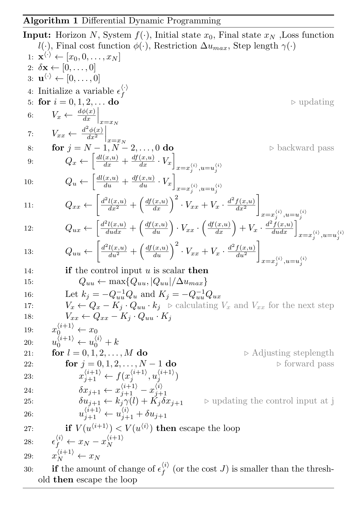
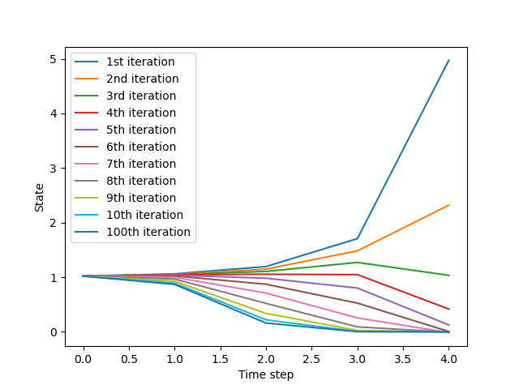
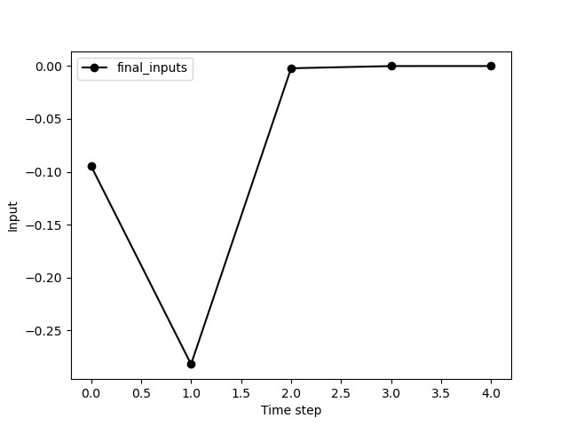
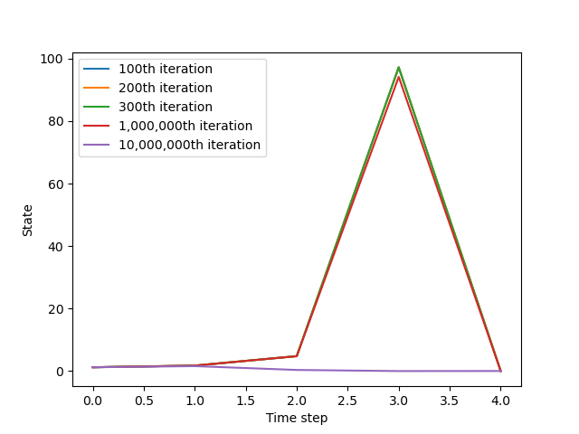
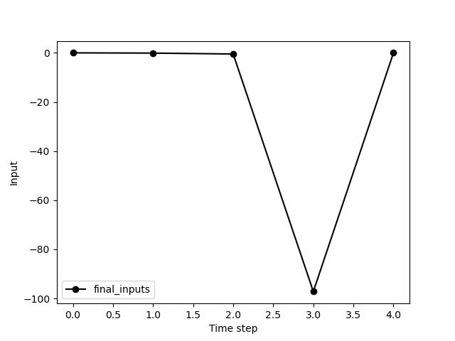
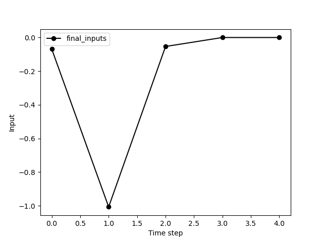
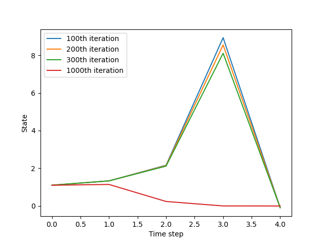
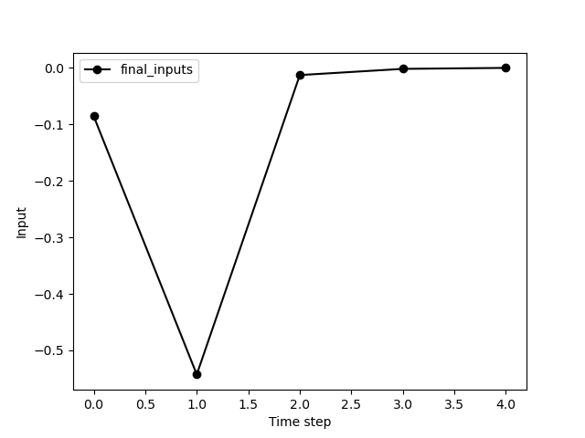

# Implementation of Differential Dynamic Programming
## Overview
Work in progress. 

Only 1-dimensional states and inputs for now.
### Requirements
`
matplotlib, numpy
`

## Gallery
Initial state=1.02

Steplength=(1/2)^l

Initial state=1.2

Steplength=(1/2)^l

The image above is captured at 1000 iteration.

The image above is captured at 10,000,000 iteration.

Initial state=1.1

Steplength=(1/2)^l

## References
[Constrained Differential Dynamic Programming Revisited](https://arxiv.org/abs/2005.00985)

[Control-Limited Differential Dynamic Programming](https://homes.cs.washington.edu/~todorov/papers/TassaICRA14.pdf)

[The Application Of Optimal Control Methodology To Nonlinear Programming Problems](https://link.springer.com/article/10.1007/BF01584253)